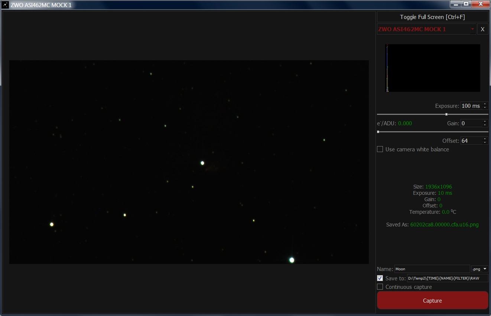

# OpenAP-AstroPhotography
Open astrophotography capture (for now only ZWO cameras and filter wheels are supported and a DIY focuser)

- On Raspberry Pi 4 for the ZWO EFW and EAF to work had to add a line to /lib/udev/rules.d/99-asi.rules as follows:  
`# EFW
KERNEL=="hidraw*", ATTRS{idVendor}=="03c3", ATTRS{idProduct}=="1f01", MODE="0666"
# EAF
KERNEL=="hidraw*", ATTRS{idVendor}=="03c3", ATTRS{idProduct}=="1f10", MODE="0666"`
